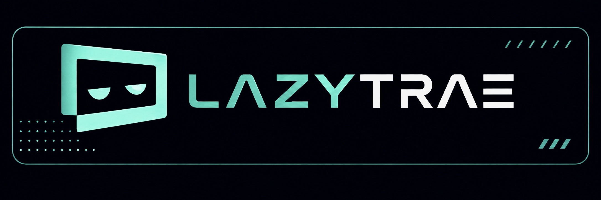

# LazyTrae



LazyTrae is a self-contained workflow harness for **Trae IDE**, **Trae Work**,
and **Trae CLI**. Its companion command installs project assets, checks local
readiness, runs completion gates, and launches a local stdio MCP server.

It is verified on macOS only. Package checks establish copied assets and local
contracts; the selected Trae surface remains the authority for discovery,
hook execution, and MCP connection.

## Start with the outcome

State the result you need, acceptance criteria, and the surface that must
prove it. Use the smallest workflow that fits the uncertainty and risk:

| Situation | Ask for | Why |
| --- | --- | --- |
| Small, well-understood change | A normal request | Avoid process for process's sake. |
| Unfamiliar repository | `lazy-init-deep` | Establish project-local instructions and context. |
| Broad or ambiguous change | `lazy-ulw-plan` | Make decisions reviewable before editing. |
| Approved plan | `lazy-start-work` | Execute against explicit acceptance criteria. |
| Failure | “Debug why … fails” | Reproduce, compare hypotheses, and verify the fix. |
| Material-risk completion | `lazy-review-work` | Add independent quality, QA, security, and scope checks. |
| Long-running goal | `lazy-ulw-loop` | Keep durable state and checkpoints. |

For a CLI project, invoke the release-owned launcher with `verify --must-pass`
before reporting a task complete. Trae hooks are advisory; hard completion
decisions live in the CLI and MCP gates.

## Design mindset

LazyTrae treats a task as an evidence problem: define the observable outcome,
keep authority with the host and user, choose local tools before heavier
providers, and exercise the surface the user actually cares about. A passing
unit test is useful evidence, not automatically proof of a CLI, page, API, or
host integration.

The package keeps `.trae/` and `.lazytrae/` project assets separate from host
settings, credentials, marketplace state, and live sessions. It does not turn
a package readiness result into a claim about a running Trae host.

## Install and onboard

Keep the pinned **v1.0.2** release in a permanent folder. Open or link that
folder in the Trae host you want to use, then give the agent the GitHub
repository link, `https://github.com/elvinzhao10/LazyTrae`, and type `onboard`.
Do not use a temporary download directory or depend on a global command.

The agent first detects or asks for **Trae IDE**, **Trae Work**, or **Trae CLI**,
then runs only safe package checks and project-local setup from the release's
absolute launcher. Package readiness is reported separately from host
readiness:

```bash
node /permanent/path/LazyTrae/lazytrae-plugin/packages/cli/bin/lazytrae.js \
  --root /absolute/path/to/project init --host ide
node /permanent/path/LazyTrae/lazytrae-plugin/packages/cli/bin/lazytrae.js \
  --root /absolute/path/to/project load-check --host ide
```

Before copying Trae Work Skills, adding a Settings → MCP connector, or
registering Trae CLI, the agent asks for approval. After approval it gives one
exact host action and waits. Once you respond, it inspects the app with
Computer Use; any reload/new-session step is a separate one-action handoff.
Host readiness is complete only after one real Skill/command and every expected
`lazytrae` core MCP connection are observed. Local checks alone leave host
readiness **pending**.

See [AGENTS.md](AGENTS.md) for the host-specific artifact boundary and manual
steps. The source is available at the [LazyTrae repository](https://github.com/elvinzhao10/LazyTrae),
with release notes on the [v1.0.2 release page](https://github.com/elvinzhao10/LazyTrae/releases/tag/v1.0.2).

## Verify and remove

The release-owned launcher with `load-check --host ide` reports **package
readiness** only. Type `offboard` for the safe-removal protocol; it preserves
host-managed paths and leaves host MCP registrations for the user to remove
through the host.

The distributable is a **self-contained CLI tarball**: after installation it
does not require a source checkout. See
[lazytrae-plugin/README.md](lazytrae-plugin/README.md) for package commands
and optional tooling lifecycle details.

## Package inventory

| Surface | Count | Role |
| --- | ---: | --- |
| CLI | 17 | Command modules for installation, state, verification, tooling, and lifecycle actions. |
| Skills | 17 | Host-facing workflow policies copied from canonical templates. |
| MCP declarations | 8 | One executable core server and seven disabled placeholders. |

## Technical reference and evaluation

The source-level explanation lives in [docs/README.md](docs/README.md). It
maps template installation, managed writes, state validation, the CLI/MCP
boundary, tooling ownership, and the release checks with diagrams tied to the
implementation.

For a capability-by-capability comparison with the original reference harness,
including what LazyTrae implements and where it intentionally differs, see
[lazytrae-evaluation.md](lazytrae-evaluation.md). Attribution and provenance
are recorded in [NOTICE](NOTICE); this is an independent implementation with
no external harness runtime dependency.

## License

[MIT](LICENSE). See [NOTICE](NOTICE) for attribution and provenance.

## Contributing

Issues and focused pull requests are welcome:

1. Search [existing issues](https://github.com/elvinzhao10/LazyTrae/issues) and
   open one for substantial behavior changes or reproducible bugs.
2. Fork the repository, create a short-lived branch from `main`, and make one
   focused change.
3. Run `npm ci --ignore-scripts`, `npm test`, `npm run test:publication`, and
   `npm pack --dry-run --json` from `lazytrae-plugin/packages/cli`.
4. Update user-facing documentation when behavior changes, then open a pull
   request explaining the outcome, compatibility impact, and verification.
5. Respond to review and wait for required checks before merge.

Read [CONTRIBUTING.md](CONTRIBUTING.md) for the complete workflow. Report
vulnerabilities privately according to [SECURITY.md](SECURITY.md), never in a
public issue.
