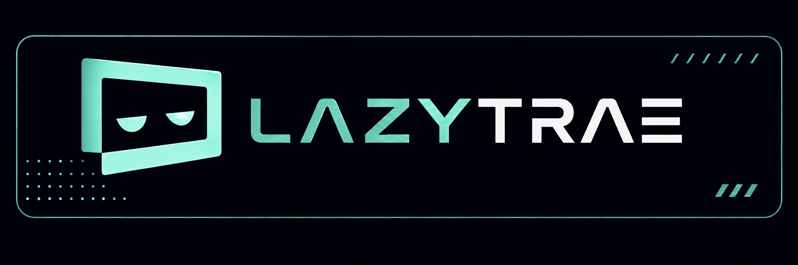

# LazyTrae



[](RELEASE_NOTES.md)
[](LICENSE)
[](#lazyseries-family)

**Describe the work. Keep the plan. Prove the result.**

LazyTrae helps you use structured, evidence-based workflows in **TraeCode**,
**TraeWork**, and **TraeCode CLI**. It prepares local project assets and checks;
a host is only considered ready after it is observed in a fresh session.

[Platform status](docs/reference/platform-status-2026-10-02.md) · [Get started](#recommended-install-with-ai-help) · [Host routes](#choose-one-route) ·
[1.3.5 notes](RELEASE_NOTES.md) · [Family](#lazyseries-family) · [Docs](docs/)

> **Current package version: v1.3.5. HOST READINESS: PENDING.** Local checks and release
> archives prove package behavior; a fresh host session must prove loading,
> command/skill execution and MCP connections.

## What's in 1.3.5

- Runtime checks execute real package and lifecycle paths; unknown exercises and failed checks cannot report success.
- Core and optional TypeScript LSP requirements are checked separately, including unsupported runtimes.
- Hook input is bounded before parsing and stays out of process arguments.
- Platform guides distinguish current native capabilities, legacy routes and integrations awaiting live acceptance.

This is a maintenance release. It includes the workflow foundation introduced
in the family since v1.3.0 and subsequent reliability work. For Kimi and DeepSeek,
that describes inherited family behavior, not prior public releases of these
ports. The details below describe the cumulative v1.3.5 experience; the
[release notes](RELEASE_NOTES.md) distinguish this patch's fixes from inherited
features. No new speed, token-saving or cost claim is made.

| Family milestone | What you get in the current package |
| --- | --- |
| v1.3.0 foundation | Natural-language entry, editable plans, durable decisions and verification tiers. |
| v1.3.1 reliability | Clearer execution intent, safer isolation and evidence comparisons. |
| v1.3.2 handoff | Revision-bound verification-report contracts; generic completion APIs have separate limits. |
| v1.3.3 hardening | Host-specific hook, MCP and publication repairs. |
| v1.3.4 maintenance | Transactional run integrity, safer lifecycle and native adapter repairs. |
| v1.3.5 repairs | Real runtime exercises, bounded hooks, dependency updates and current platform guidance. |

### Just ask, or use a command — both work

Two entry routes converge on the same execution authority and gates:

- **Natural language**: describe the work plainly — "Fix the typo in the
  welcome label" — and the smallest sufficient workflow is selected and run.
- **Explicit commands**: `/lazy-ulw-plan <idea>` builds a new plan, and
  `/lazy-start-work <plan>` executes a known plan. Same authority, same gates.

No command is required for a clear implementation request. Conversely, asking
to *explain*, quoting a command, or saying "plan only" never touches your
files: the persisted `execution_intent` stays `plan_only` until you actually
ask for execution, and a vague "ok" with several open questions never grants
execution by itself.

### Plans you can edit while work runs

Plans are Markdown you own. Edit them mid-run; the harness reconciles your
changes at execution boundaries instead of overwriting them:

- Cosmetic wording and ordering edits preserve existing evidence.
- Semantic edits (acceptance, dependencies, verification commands) invalidate
  only the affected task and its dependents — unrelated work is untouched.
- Your checkbox is an *assertion*, not a verdict: a checked box alone never
  counts as verified completion, and unchecking reopens the task.

### Decisions the harness remembers

Cross-plan decisions live in a durable ledger
(`.lazytrae/decisions/ledger.jsonl`). When plan two hits a question plan one
already answered — with evidence — it recalls the decision instead of
re-asking you. Contradictions are surfaced as supersessions, defects become
scoped corrections that block only the affected work, and nothing in memory
can override your current instructions.

### Verification sized to the change

The workflow calls for verification sized to the change: a documentation
inspection (V0), a focused check (V1), an integration scenario (V2), or a
comprehensive security/release gate (V3, normally in CI). Valid evidence may be
reused while its inputs match; affected, missing or stale checks must rerun.
Native execution still needs acceptance in the selected host.

Milestones, decision gates, and full state/version semantics are shared
byte-identically with LazyBuddy and LazyQoder (see
`lazytrae-plugin/packages/cli/contracts/lazyseries-shared-semantics.v1.json`).

## Recommended: install with AI help

You do not need to work through the technical setup alone. Open an AI coding
assistant in your project and paste this:

> Help me install LazyTrae from https://github.com/elvinzhao10/LazyTrae for
> this project. Use v1.3.5 and follow AGENTS.md and the current install guide. Run safe package checks first,
> explain each step plainly, and ask me before changing host settings, adding
> an MCP connector, or registering anything in Trae.

The assistant can guide onboarding, but you approve every host-managed change.

## Manual setup

Manual setup is available when you prefer complete control. You need
**Node.js LTS 24 (recommended) or 22 (supported alternative)** and **Git**. The lifecycle also accepts Node.js LTS 20 for compatibility. Start from the verified origin
`https://github.com/elvinzhao10/LazyTrae` and follow the
[installation guide](docs/03-install-and-host-verification.md).

Run `lifecycle onboard` once to create a durable installation. After that, use
the stable launcher for `lifecycle status` and safe lifecycle actions:

```text
node "<install-root>/LazyTrae/launcher.js" lifecycle status
```

## What “ready” means

- **Package readiness** means LazyTrae's local files and checks are valid.
- **Host readiness** needs a fresh Trae session, one real Skill or command,
  and the expected core MCP connection.

Until that is observed, the honest result is **HOST READINESS: PENDING**.
Local files and checks never prove that a host has loaded the package.

## Choose one route

Pick one host route during onboarding:

- **TraeCode** uses project assets and an optional bounded probe.
- **TraeWork** supports local desktop work; other client and execution
  profiles are descriptive only.
- **TraeCode CLI** (`traecli`) can generate a local candidate, but it stays inert until a
  current probe confirms the selected runner.

For manual Work or CLI setup, use `load-check --host work` or
`load-check --host cli`. Copy only the configuration between
`LAZYTRAE_MCP_JSON_BEGIN` and `LAZYTRAE_MCP_JSON_END` into the documented
manual settings flow, such as **Settings → MCP**. LazyTrae does not assume a public universal MCP registration command.

The generated files are the **documented package route**. Any host-specific
result is an **observed prerelease route**, not a universal host guarantee.
Approve one exact host action, then wait for its result. If available,
Computer Use or a user-provided screenshot/status can verify a reload or new
session.

## Design mindset

Start with the result you want and how you will know it worked. Then use the
smallest amount of structure that fits the task. You can simply describe the
work in plain language; the modes are guidance, not commands you need to
memorize. The v1.3.0 dual-entry routing picks one of these for you.

| Mode | Use it when | Example request |
| --- | --- | --- |
| Direct | The change is small and clear. | “Fix this error and run the relevant test.” |
| Assisted | You need help understanding an unfamiliar area or failure. | “Help me find why this command fails, then verify the fix.” |
| Planned | The work has several parts or important choices. | “Make a plan for this feature before changing files.” |
| Orchestrated | The work affects a release, security, or a risky change. | “Review this release and prepare it for publication.” |
| Long-horizon | The goal needs to continue across sessions. | “Keep working on this migration with checkpoints.” |

## Keep host changes deliberate

LazyTrae does not automate credentials, external services, or host
registrations. It asks for approval before host-managed actions and keeps safe
package checks separate from settings and connector changes.

## Package inventory

| Surface | Count | Role |
| --- | ---: | --- |
| Skills | 17 | Host-facing workflow policies for planning, execution, review, and verification. |
| Commands | 9 | Named host entry points for those workflow policies. |
| Agents | 11 | Specialist role definitions for planning, implementation, QA, security, and context. |
| MCP declarations | 8 | One local core service and seven disabled capability placeholders. |

## LazySeries family

**One workflow philosophy. Six host integrations.** Choose the sibling for the
host you use; each keeps its own native adapters, installation route and
acceptance evidence. These packages run independently.

| Sibling | Target host |
| --- | --- |
| [LazyBuddy](https://github.com/elvinzhao10/LazyBuddy) | CodeBuddy CLI / IDE · WorkBuddy |
| [LazyTrae](https://github.com/elvinzhao10/LazyTrae) **← you are here** | TraeCode / TraeWork / TraeCode CLI |
| [LazyQoder](https://github.com/elvinzhao10/LazyQoder) | Qoder CLI / IDE / app |
| [LazyZCode](https://github.com/elvinzhao10/LazyZCode) | ZCode |
| [LazyKimi](https://github.com/elvinzhao10/LazyKimi) | Kimi Code CLI · Kimi Work (experimental) |
| [LazyDeepSeek](https://github.com/elvinzhao10/LazyDeepSeek) | DeepSeek Harness 0.2.0-rc.2 |

The family shares planning, evidence, decision-memory and completion contracts.
The first shared verification core is vendored in every package; product adapters keep host setup and permissions explicit. Matching contracts do not make host capabilities interchangeable. In particular,
Kimi Work remains experimental for LazyKimi, and DeepSeek's synthesized events
are not native hooks. Use each sibling's host guide before installation.

## Technical reference and evaluation

The source-level explanation lives in [docs/README.md](docs/README.md). It
maps the package, execution flow, state model, security boundaries, MCP
lifecycle, host differences, and release checks with diagrams tied to the
implementation.

For a capability-by-capability account of what the package implements and what
its tests verify, see [lazytrae-evaluation.md](lazytrae-evaluation.md).

LazyTrae is primarily inspired by LazyCodex
([upstream project](https://github.com/code-yeongyu/lazycodex)). Its
relationship to OmO and upstream sources is recorded in [NOTICE](NOTICE).
It is an independent implementation and does not require LazyCodex or OmO at
runtime.

<details>
<summary>Trae runtime and lifecycle details</summary>

Automatic selection reads the native current task, loop, and session state; it
does not infer proprietary host execution. A fully matching identity can be
carried in a bounded context capsule for a real handoff or recovery, while
missing or mismatched state is rejected. The measured representative capsule is
1,076 bytes versus a 7,227-byte native preimage (85.11% smaller). This is a
same-packet measurement only—not a token, worker, or host-performance claim.

Host presentation stays advisory: LazyTrae records `presented-to-host` and
`not-observed` rather than claiming a Trae UI executed it. `init` and `sync`
preflight managed conflicts, promote receipt-owned assets transactionally, and
preserve caller state, evidence, modified, unknown, and linked files.

Execution onboarding and review templates now send a compact fixed contract
plus only the task delta and artifact paths. They first capture read-only
status/ownership provenance and validate each safe plan check as argv once;
shell operators, mutating/dependency/remote commands, and approval-gated
actions are rejected. A recoverable result must match the active task,
execution revision, and every criterion; runtime criteria also prove a real
entrypoint transition. Passing review lanes are preserved, while only failed,
missing, stale, or input-affected lanes rerun; all five lanes still require
PASS. Context capsules redact secret-bearing free text, and a stale active goal
is rejected before checkpoint state can change.

The commercial TraeCode CLI is a separate host from the open-source TRAE-agent
project. LazyTrae remains a separate native integration with its own package
and observed-host evidence. It does not substitute TRAE-agent execution for a
commercial CLI session. The base topology is one active core MCP server with
15 tools; seven optional capability declarations remain disabled placeholders.

Loop selection returns distinct active, blocked, failed, exhausted, and complete
outcomes. Only a verified checkpoint records loop completion. Starting a pending
goal consumes one global iteration; resuming that goal consumes none. Repeated
`create-goals` refuses an existing goal set; use steering to change current work.
Loop writers reject stale revisions, and installed post-tool hooks carry their
own local path and transaction helpers to record edits without a source checkout.
Trae hooks remain advisory and exit zero; CLI and MCP own hard completion gates.

</details>

## Learn more

- [Install and verify a host](docs/03-install-and-host-verification.md)
- [Remove receipt-owned assets safely](docs/08-safe-removal.md)
- [Workflow playbooks — how the modes pick work](docs/04-workflow-playbooks.md)
- [Evidence and completion — what "done" proves](docs/05-evidence-and-completion.md)
- [Host routes and recovery](docs/reference/host-routes.md)
- [Release notes](RELEASE_NOTES.md)
- [Documentation index](docs/README.md)

## License

[MIT](LICENSE). See [NOTICE](NOTICE) for attribution and provenance.

## Contributing

Issues and pull requests are welcome. Read [CONTRIBUTING.md](CONTRIBUTING.md)
for development checks, release expectations, and guidance for reporting
sanitized reproduction details. From `lazytrae-plugin/packages/cli`, `npm run
test:source` and `npm run test:package` cover disjoint sets of `*.test.js`
files; `npm run test:all` runs their complete non-overlapping union. The harness
uses two workers by default. Set `LAZYTRAE_TEST_CONCURRENCY=1` for a fully
serial check or an integer up to `4` for a bounded local run. Report
vulnerabilities privately according to [SECURITY.md](SECURITY.md).
