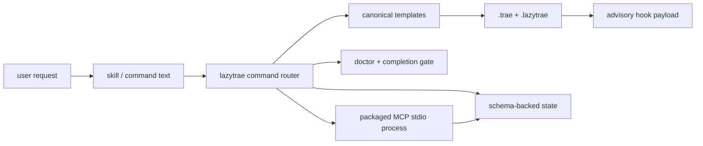

# Architecture tour

LazyTrae is not one runtime. It is a distributable CLI plus declarative Trae assets and a packaged local MCP server. The technical question at every boundary is: *who owns this file or process, and what observation can prove it ran?*

The arrows are not all automatic. Skills and commands are instructions that a host or agent may invoke; the host decides whether it loads them. `init` copies or merges only permitted project assets. MCP declarations merely tell a host how to start a local process. The package can validate every file in that path, but only a host observation proves discovery or connection.

## Package boundary

`lazytrae-plugin/` is the distributable unit. It contains:

- `.trae/` and `.lazytrae/`: reference host assets, schemas, and defaults;
- `packages/cli/`: command router, installer, safe-write helpers, doctor, completion gates, tooling lifecycle, and templates;
- `packages/mcp/`: self-contained local JSON-RPC server and handlers;
- `packages/cli/templates/`: the canonical assets copied into a consumer project;
- `packages/cli/test/` and `packages/mcp/test/`: package, lifecycle, and protocol regressions.

The repository root holds public explanations and evaluation evidence. It is not required after the self-contained CLI tarball is installed. Trae settings, credentials, marketplace state, and live sessions remain host/user state.

## Follow one real path

Start in [07 — Package map](07-package-map.md). Then trace a workflow request through [04 — Workflow playbooks](04-workflow-playbooks.md), an `init` write through [03 — Package delivery](03-install-and-host-verification.md), a persisted record through [07a — State and validation](07a-state-and-validation.md), and a protocol request through [07b — MCP lifecycle](07b-mcp-lifecycle.md). Finish with [09 — Test and release verification](09-test-and-release-verification.md) to see how the repository tests each boundary.
