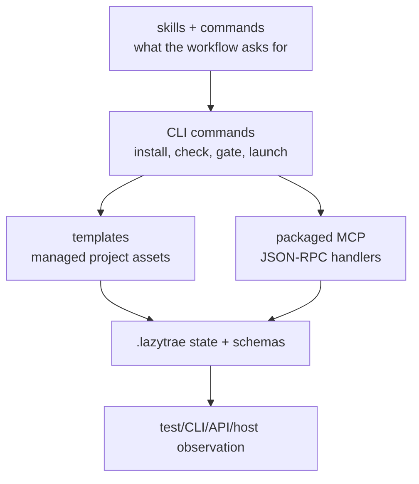

# Execution model

LazyTrae separates *policy*, *installation*, *execution*, *durable state*, and *proof*. That separation prevents a template, an installed declaration, or a passing local check from being mistaken for a live Trae capability.

## Policy is not execution

Skills and commands describe how an agent should approach planning, debugging, review, or completion. Agent files narrow that guidance to a role. They do not gain authority merely by existing: a host must select and load them, and an agent must still perform the described work.

## Installation is not host proof

The CLI copies canonical templates into `.trae/` and `.lazytrae/`, merging managed blocks and refusing protected destinations where required. This proves the project layout only. TraeCode, Work, or CLI must separately discover the assets, run hooks, and connect MCP.

## Execution is not proof

Commands implement the operational layer: state writes, schema validation, doctor, completion gates, tooling lifecycle, and the MCP launcher. Their output is package evidence. Proof must be chosen for the requested surface: a test for library behavior, a CLI invocation for a CLI, a browser check for a page, or an observed host session for an integration.
