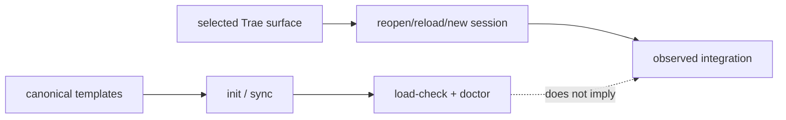

# Package delivery

This page explains the deployment boundary in code terms. The CLI contains canonical templates and a local MCP runtime; it does not contain Trae's settings database, session state, or live connector process table.

## Template installation pipeline

`packages/cli/src/commands/init.js` is the installer. It resolves the target project, copies or merges files from `packages/cli/templates/`, and then runs the selected host's load check. `sync.js` follows the same managed-content rules for later updates. The safe-write and managed-block helpers prevent an update from silently overwriting protected destinations.

The templates produce `.trae/` workflow assets and `.lazytrae/` schemas/state defaults. The executable `lazytrae` companion and packaged MCP server are separate installed artifacts; the self-contained CLI tarball does not need the source checkout after installation.

## Two evidence channels

The first channel supports claims about project assets and local contracts. The second supports claims about Trae discovery, hook execution, and MCP connection. Keeping them separate is what lets uninstall be safe: package removal cannot guess where a host stored registrations or settings.

## Delivery surfaces

Trae IDE loads project assets, Trae Work uses its separate skills lifecycle and manual MCP route, and Trae CLI requires its own registration/new-session sequence. The detailed host adapters are in [Host capability matrix](10-host-capability-matrix.md) and [Host routes](reference/host-routes.md).
