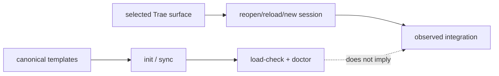

# Package delivery

This page explains the deployment boundary in code terms. The CLI contains canonical templates and a local MCP runtime; it does not contain Trae's settings database, session state, or live connector process table.

## Local-first onboarding

Keep the pinned `v1.0.2` release in a permanent folder, open or link it in the
selected Trae host, give the agent
`https://github.com/elvinzhao10/LazyTrae`, and type `onboard`. The agent detects
or asks for Trae IDE, Trae Work, or Trae CLI, runs safe package checks, and
reports package readiness separately from host readiness. Before copying Work
Skills, adding a Settings → MCP connector, or registering Trae CLI it asks for
approval, gives one exact host action, and waits. After the response it
inspects the app with Computer Use; reload/new-session is a separate action.
If Computer Use is unavailable, a user-pasted verbatim status or screenshot is
observed evidence; without either, **HOST READINESS: PENDING**.
Verify one real Skill/command and the expected `lazytrae` core MCP connection;
local checks alone leave host readiness pending.

The release launcher and generated configuration are the **documented package
route**. The supplied macOS IDE/Work results are an **observed prerelease
route**, not general host support. CLI setup is JSON/manual because LazyTrae
does not assume a public universal MCP registration command.

For Work, run the absolute local launcher with `load-check --host work`; for
CLI, use `load-check --host cli`. Copy only the JSON between
`LAZYTRAE_MCP_JSON_BEGIN` and `LAZYTRAE_MCP_JSON_END`. After approval, paste it
into Work's **Settings → MCP** or the selected CLI build's documented/manual
MCP settings flow. Pasting, reloading/new session, and testing are separate
actions. The package result does not change **HOST READINESS: PENDING**.
The supplied QA could not access Trae CLI; its live-host route is unverified.

## Template installation pipeline

`packages/cli/src/commands/init.js` is the installer. It resolves the target project, copies or merges files from `packages/cli/templates/`, and then runs the selected host's load check. `sync.js` follows the same managed-content rules for later updates. The safe-write and managed-block helpers prevent an update from silently overwriting protected destinations.

The templates produce `.trae/` workflow assets and `.lazytrae/` schemas/state defaults. The executable `lazytrae` companion and packaged MCP server are separate installed artifacts; the self-contained CLI tarball does not need the source checkout after installation.

## Two evidence channels

The first channel supports claims about project assets and local contracts. The second supports claims about Trae discovery, hook execution, and MCP connection. Keeping them separate is what lets uninstall be safe: package removal cannot guess where a host stored registrations or settings.

## Delivery surfaces

Trae IDE loads project assets, Trae Work uses its separate skills lifecycle and manual MCP route, and Trae CLI requires its own registration/new-session sequence. The detailed host adapters are in [Host capability matrix](10-host-capability-matrix.md) and [Host routes](reference/host-routes.md).
