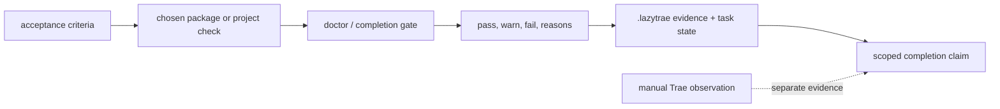

# Evidence and completion

Completion is a claim about the requested outcome, not merely a changed file or
a passing installation check. Start with the practical loop in
[Your first task](02-first-task.md), then capture enough evidence for someone
else to assess the result.

## What good evidence includes

- The acceptance criterion and the command or manual scenario that checks it.
- Commands run, relevant output, and exit statuses.
- Changed files and any remaining limitation or blocker.
- A real-surface check: for example, the UI, CLI, API, or data path a user will
  actually use.
- Review findings where the work is significant or risky.

The evidence templates under `.lazytrae/evidence/` cover plan reread,
automated verification, manual QA, adversarial QA, cleanup, reviewer work, test
runs, and handoff. They are durable records, not a substitute for performing
the checks.

## Gates and the advisory-hook boundary

The workflow names five gates: plan reread, automated verification, manual QA,
adversarial QA, and cleanup. A heavier review route can ask Oracle to consolidate
goal, quality, security, QA, and context findings. Scale the work: a small,
low-risk change may need focused tests and one manual scenario, while a broad
change merits the full set.

Hooks can prompt for this discipline, but they are advisory. All configured
hooks exit 0 and never block host operations. Therefore neither `load-check`,
`doctor`, a hook message, nor a generated evidence file proves a host loaded
the package or that the feature works. `load-check` and `doctor` describe local
package readiness and health only; the selected host still needs the observation
in [Host routes](reference/host-routes.md).

## Enforced completion paths

Use `lazytrae verify --must-pass` when the task needs the CLI hard gate. The
MCP server also offers `lazytrae.record_evidence`, which writes a gate record,
and `lazytrae.mark_task_done`, which refuses to complete a task without
non-empty, existing evidence paths. The latter updates Boulder state; it does
not independently run tests or prove a host connection.

The core server has 15 tools only after a host has connected it. Its tool list
and the distinction between a declaration and a connection are in
[Capabilities and approvals](06-capabilities-and-approvals.md) and
[MCP lifecycle](07b-mcp-lifecycle.md). For package and release evidence, use
[Test and release verification](09-test-and-release-verification.md).

## A compact completion statement

When reporting completion, say what changed, what you ran, what you manually
observed, and any limitation. For example: “Added project search; focused tests
passed; verified a search in the browser; no known remaining blocker.” Do not
say “complete” solely because files were copied, a doctor passed, or a host was
not observed.

## Evidence data flow

Evidence is not a single boolean. The package carries several facts from a
check into the final report:

`doctor.js` reports health checks; `verify.js --must-pass` combines its result
with `getCompletionStatus`; evidence/task handlers keep state references
separate from the check output. This lets a reviewer distinguish “project
assets are ready,” “completion gates are ready,” “the requested surface was
observed,” and “a host fact remains unverified.”
