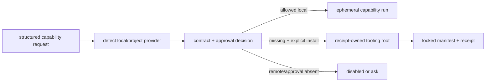

# Capabilities and approvals

LazyTrae starts local-first. Its automatic route can select safe local `rg`,
`sg`, or a read-only LSP bridge for one task and then tear down the temporary
tooling. It does not change project dependencies, lockfiles, `.trae/mcp.json`,
or host MCP settings. This differs from explicitly enabling persistent
compatibility.

## Choose the least invasive capability

| Need | Appropriate route | Important boundary |
| --- | --- | --- |
| Exact files or text | `rg` | Local search. |
| Code structure | `sg` / ast-grep | Local structural search. |
| Definitions, references, symbols, diagnostics | Separate read-only LSP bridge | Explicit owned tooling root; it rejects rename and does not mutate the target project. |
| Architecture/dependency question in a large prepared repo | CodeGraph | Explicit lifecycle and approval; separate MCP process, not a core tool. |
| Current library docs or public examples | Context7 or `grep_app` | Disabled by default; explicit persistent selection. |
| Browser, filesystem, external operations, secrets | Optional capability | Approval rules still apply. |

The LSP bridge supports JavaScript/TypeScript and Python only. It detects an
existing project or host provider before it provisions the package-owned
fallback. `lazytrae tooling verify` can discover native lint, typecheck, test,
and build commands, but runs none until the caller selects `--run`.

## Core MCP versus optional declarations

The base `.trae/mcp.json` contains eight declarations: one executable local
`lazytrae` core server and seven disabled placeholders (`grep_app`, `context7`,
`filesystem`, `git`, `playwright`, `ast_grep`, and `lsp`). Only the core server
has the 15-tool contract, and it exposes those tools after a host connection.
They cover state and plan reads; evidence recording; task completion and
blockers; review requests; handoff; parity; heuristic symbol, reference, and
definition lookup; detected diagnostics; local documentation lookup; and a
heuristic dependency graph. They do not turn a declaration or a readiness check
into proof of a connection.

Context7 and `grep_app` stay disabled unless an operator explicitly enables a
namespaced `lazytrae_*` MCP selection. Normal install, InitDeep, doctor, and
status do not contact them. Credential configuration uses an opaque `env:NAME`
reference, never a raw credential stored in project state; status output stays
redacted. See [Package map](07-package-map.md) for where these declarations
live.

## Approval boundary

Provider output is untrusted and queries are sanitized and bounded. Metered
services need an explicit bounded budget. CodeGraph and Playwright need
approval. Authenticated browser work, forms, external writes, purchases,
destructive actions, and secret reads always prompt. A status command is
read-only; it neither grants approval nor enables a service.

CodeGraph is warranted only for explicit architecture/dependency work on a
prepared large repository. Its doctor recommends it at 500 supported source
files or 100,000 supported source lines, but does not download, start, or index
anything. `codegraph-install`, `codegraph-init`, and `codegraph-enable` are
separate explicit steps. The index remains caller-owned; uninstall removes only
an unmodified receipt-owned tooling root, never a project `.codegraph/`
directory.

The same ownership logic governs every optional dependency listed in
[NOTICE](../NOTICE): it is provisioned only into an explicit receipt-owned root
with locked records, and is not an operational dependency of this project.
Read [Security and authority](06a-security-and-authority.md) for the decision
boundary and [Receipts and owned tooling](06b-receipts-and-owned-tooling.md)
for its removal boundary.

## Capability decision pipeline

The tooling implementation separates discovery, policy, execution, and ownership so a missing executable cannot silently become an install request:

`commands/tooling.js` is a dispatcher, not a provider itself. `runCommand` routes lifecycle verbs to `runLsp`, `runCodeGraph`, `runOptionalCapability`, or the automatic capability broker/detector. `install` first calls `assertSafeRoot`, determines the missing capabilities, writes a package/lock pair inside the caller-selected root, runs `npm ci --ignore-scripts`, and only then writes a receipt for the owned entries.

The separation matters for failure behavior: `status`, `doctor`, and `capability-status` are read-only; `install`, `codegraph-install`, and `lsp-install` require an explicit root; `enable`/`disable` update only managed namespaced optional entries after the project has been initialized. The command router rejects raw credential-looking arguments before optional capability state is touched.
