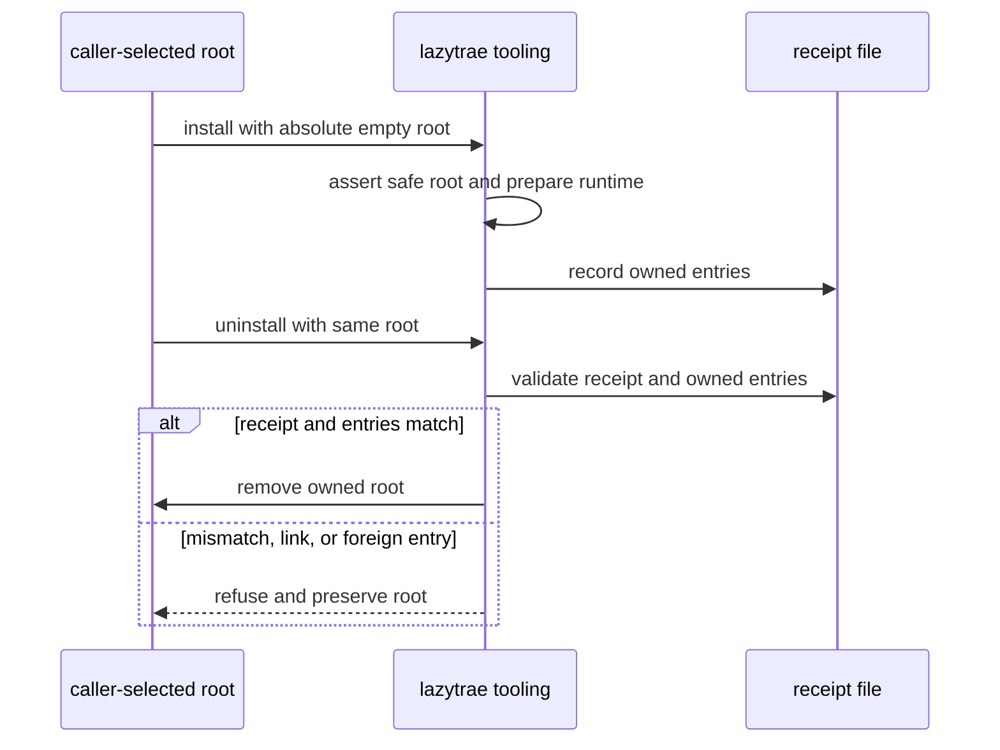

# Receipts and owned tooling

Ownership, not directory names, controls what LazyTrae can remove. A receipt
identifies exact package-owned content; it does not make user edits, host
configuration, or project indexes disposable.

## Receipt-safe removal

`lazytrae uninstall --yes`, `--soft`, and `--purge-state` remove only the
scope whose content still matches the package receipt. Modified, unknown,
linked, caller-owned, project, and host-managed paths stay in place. Normal
runtime records are preserved. `--soft` and `--purge-state` cannot be combined.

Tooling roots use the same rule: an unmodified receipt-owned root can be
removed, while a caller-owned CodeGraph `.codegraph/` index is preserved.
TraeWork removal on macOS checks each listed `lazy-*` skill and preserves
edited, linked, or nonempty directories. Host MCP registrations are always a
separate manual action. See [Safe removal](08-safe-removal.md).

When a trusted package-owned tooling command times out, LazyTrae requests
best-effort termination of its owned process group. This is cleanup, not a
security sandbox, and it cannot guarantee that every descendant has exited.

## Explicit tooling enablement

The temporary local route is not a persistent installation. Use
`lazytrae tooling enable <capability>` only when an operator explicitly wants a
managed namespaced optional MCP selection. Disable it with `lazytrae tooling
disable <capability>`; this removes only the corresponding LazyTrae-managed
entry. Optional dependencies live in an explicit receipt-owned tooling root,
never as an implicit runtime dependency of the project.

For the decision rule, see [Security and authority](06a-security-and-authority.md).

## Receipt verification sequence

The tooling implementation treats installation and removal as inverse operations, not as two directory commands:

`lib/tooling-root` supplies `assertSafeRoot`, `readReceipt`, `validateReceipt`, `listOwnedEntries`, and `removeReceiptOwnedRoot`. `commands/tooling.js:checkRoot` uses the read/validate path for status and doctor; `install` writes the receipt only after a successful package install; `uninstall` delegates to exact receipt-owned removal. LSP and CodeGraph use their own lifecycle helpers, but retain the same explicit-root rule. A project `.codegraph/` index is not an owned toolpack entry, so it remains caller-owned.
