# Package map

`lazytrae-plugin/` is the runtime package. Its layout separates canonical Trae assets from the installable CLI control plane and the self-contained MCP process.

```mermaid
flowchart TB
    Templates["packages/cli/templates/"] --> Init["commands/init.js + sync.js"]
    Init --> Project[".trae/ + .lazytrae/"]
    Router["packages/cli/src/index.js"] --> Commands["commands/*.js"]
    Commands --> Lib["lib/*.js"]
    Commands --> Project
    Router --> MCP["commands/mcp.js"]
    MCP --> Server["packages/mcp/src/index.js"]
    Server --> State[".lazytrae/state"]
    Tests["packages/cli/test + packages/mcp/test"] -. probes .-> Router
    Tests -. probes .-> Server
```

## Templates and managed content

`packages/cli/templates/` is the installation source of truth. It contains skills, commands, agents, rules, hooks, schemas, defaults, evidence templates, and MCP declaration content. `init.js` and `sync.js` copy or merge those assets into a caller-selected project. Safe-write helpers resolve paths beneath the project root and preserve protected or modified destinations when policy requires it.

The checked-in `.trae/` and `.lazytrae/` directories show the reference layout. A consumer project is authoritative only after `init` has run there; source-tree files are not evidence that a separate project was initialized.

## Component relationships

`src/index.js` routes user commands to modules under `src/commands/`. Command modules keep the visible lifecycle small: initialize/sync, doctor/verify, hook dispatch, loops/teams, tooling, work skills, uninstall, and MCP launch. Shared modules under `src/lib/` implement path boundaries, managed blocks, schema validation, receipts, capability policy, and completion checks.

`packages/mcp/` is independently packaged. Its `index.js` maintains a line-oriented JSON-RPC loop, `tools.js` maps namespaced tools to handlers, and handler modules operate through `state-access.js` and runtime safe-write/path-boundary utilities. The CLI starts that package; it does not require the repository root at runtime.

## Trace one request through the code

1. `src/index.js` validates the command name and delegates to a command module.
2. `init.js` obtains a project root, reads canonical template content, then invokes safe copy/merge helpers. A managed block is updated only within its markers; protected destinations are reported rather than overwritten.
3. State-changing commands use `.lazytrae/` paths and schema-backed records. `validator.js` compiles schemas with `ajv-formats`, so required RFC3339 timestamps are actually checked.
4. `doctor.js` reports package/project health; `verify.js --must-pass` combines doctor output with completion-gate status. Trae hook scripts remain advisory, so hard completion enforcement is kept in these CLI/MCP paths.
5. `mcp.js` launches the packaged stdio server. It parses one JSON-RPC request per line, returns structured errors for malformed input, and continues to process later requests.
