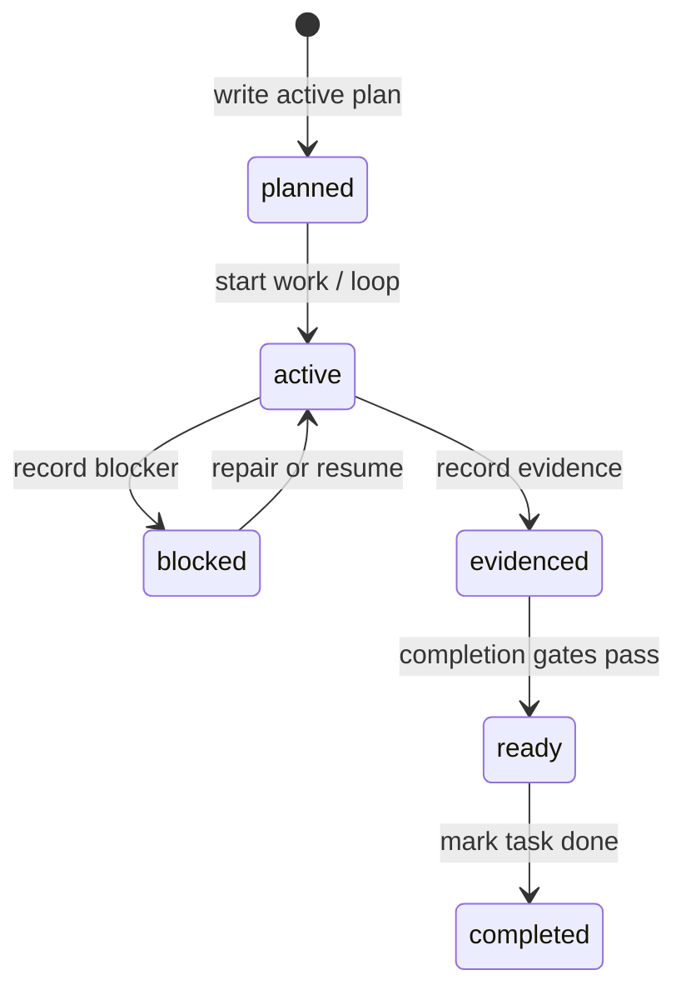

# State and validation

LazyTrae makes long-running work inspectable through explicit `.lazytrae/` records rather than conversation memory. CLI and MCP helpers own the transition rules; callers should not synthesize state files by hand.

## State artifacts

`.lazytrae/state/` holds durable workflow records such as `active-loop.json`, `boulder.json`, and `sessions.json`; `.lazytrae/evidence/` holds evidence documents. Templates seed the expected shape during initialization. The CLI and MCP use the same state namespace but retain separate process boundaries: the CLI is the control plane, while the MCP exposes selected reads/writes over JSON-RPC.

`state-access.js` derives the repository root and constrains writes below `.lazytrae/`. It uses atomic write/append helpers and short-lived directory locks to avoid silently writing outside the designated state domain.

## Date-time validation

`src/lib/validator.js` loads the schema paired with each recognized state file, compiles it with Ajv plus `ajv-formats`, and checks both the JSON shape and schema-version contract. This matters because a JSON Schema `date-time` keyword is only meaningful when the format implementation is present: malformed timestamps must fail rather than be silently ignored.

`doctor` surfaces schema failures as health evidence. Completion checks additionally ensure that tasks marked complete reference existing, non-empty evidence files within the repository boundary.

## Read state at the correct boundary

State establishes what the package recorded and validated. It does not establish that Trae IDE, Work, or CLI loaded a skill, ran a hook, or connected MCP. Package readiness and state integrity are local facts; host integration remains a separate user observation.
