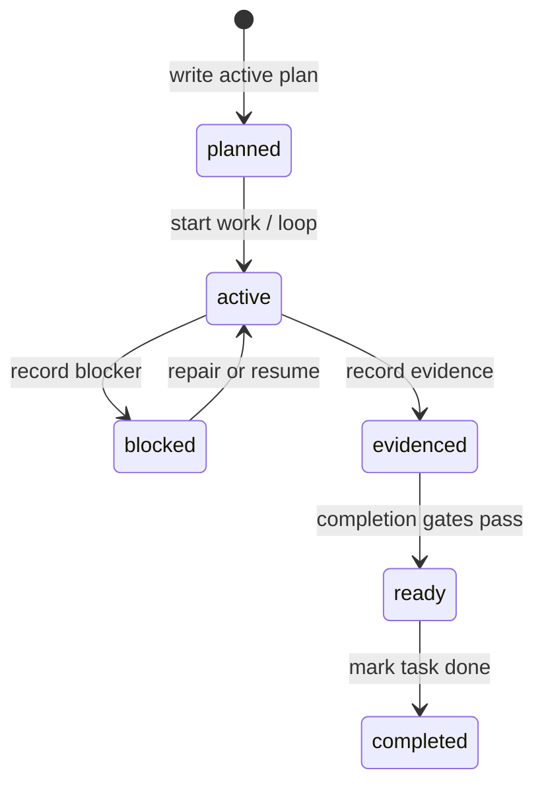

# State and validation

LazyTrae makes long-running work inspectable through explicit `.lazytrae/` records rather than conversation memory. CLI and MCP helpers own the transition rules; callers should not synthesize state files by hand.

## State artifacts

`.lazytrae/state/` holds durable workflow records such as `active-loop.json`, `boulder.json`, and `sessions.json`; `.lazytrae/evidence/` holds evidence documents. Templates seed the expected shape during initialization. The CLI and MCP use the same state namespace but retain separate process boundaries: the CLI is the control plane, while the MCP exposes selected reads/writes over JSON-RPC.

`state-access.js` derives the repository root and constrains writes below `.lazytrae/`. It uses atomic write/append helpers and short-lived directory locks to avoid silently writing outside the designated state domain.

## Date-time validation

`src/lib/validator.js` loads the schema paired with each recognized state file, compiles it with Ajv plus `ajv-formats`, and checks both the JSON shape and schema-version contract. This matters because a JSON Schema `date-time` keyword is only meaningful when the format implementation is present: malformed timestamps must fail rather than be silently ignored.

`doctor` surfaces schema failures as health evidence. Completion checks additionally ensure that tasks marked complete reference existing, non-empty evidence files within the repository boundary.

## Read state at the correct boundary

State establishes what the package recorded and validated. It does not establish that Trae IDE, Work, or CLI loaded a skill, ran a hook, or connected MCP. Package readiness and state integrity are local facts; host integration remains a separate user observation.

## Artifact lifecycle at field level

The state model is intentionally split by concern:

| Artifact | Primary reader/writer | Important fields and rule |
| --- | --- | --- |
| `boulder.json` | completion gates and task handlers | `active_work_id`, work/task status, blockers, and `evidence_paths`; completion requires usable evidence. |
| `active-loop.json` | loop runtime and completion gates | lifecycle status and run progress; a nonterminal active loop prevents a ready result. |
| `sessions.json` | session-oriented commands/handlers | session records constrained by its schema and version contract. |
| evidence files | evidence handlers and verifier | must be an existing, non-empty repository-local file when referenced by a completed task. |

`getBoulderState`, `getLoopState`, and `getSessionsState` are read helpers.
`writeJSON`, `appendText`, and `writeText` route mutations through the safe
write layer. `withFileLock` creates a directory lock beside a file, retries a
bounded number of times, and removes the lock in `finally`; contention becomes
an explicit `LOCK_CONTENDED` error rather than an unbounded wait.

## Validation failure path

`validateStateFile` follows a strict order: locate state and schema, parse
both JSON documents, ensure Ajv plus `ajv-formats` is available, compile the
schema, validate the data, then verify the expected schema-version field.
`checkCompletedTaskEvidence` is a second pass because existence, file type,
non-emptiness, and repository containment of evidence references cannot be
represented by JSON Schema alone.

That order keeps error reports actionable: “invalid JSON,” “schema missing,”
“invalid date-time,” “wrong version,” and “evidence path escapes the project”
are different repair actions rather than one generic invalid-state result.
