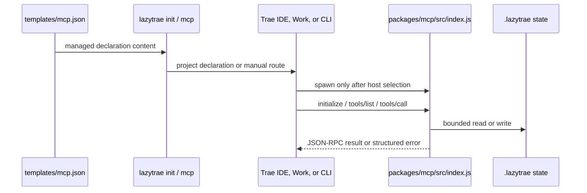

# MCP lifecycle

An MCP declaration is static configuration. A connected MCP tool is a running stdio process speaking JSON-RPC. LazyTrae documents and tests both layers without confusing either with host proof.

## Declaration is not connection

`packages/cli/templates/mcp.json` is copied or merged by `init` into a project declaration when the destination is writable under policy. It names one executable core server and seven disabled placeholders. Trae Work still requires manual MCP registration; Trae CLI requires its own registration command. A declaration in either location proves configuration content, not a launched connection.

## Core server and optional declarations

`packages/mcp/src/index.js` reads one JSON object per stdin line, validates request shape, dispatches `initialize`, `tools/list`, `tools/call`, and `ping`, then writes a JSON-RPC result or error line to stdout. `tools.js` maps the 15 namespaced core tools to handlers. `state-access.js` and runtime helpers restrict state mutations to the `.lazytrae/` domain.

Malformed JSON yields `-32700`; structurally invalid requests yield `-32600`; unknown methods and tools yield `-32601`. The loop continues after errors, which makes the server robust to a malformed stream without pretending that the host connected successfully.

Optional capability entries are separate from the base core. They remain disabled until their explicit lifecycle changes project state and regenerates the managed declaration. CodeGraph has its own receipt-owned package lifecycle and caller-owned index; remote providers, filesystem, and Playwright remain host-mediated decisions.

## Request-processing contract

The core server has a deliberately small protocol loop:

1. `main` determines a repository root and attaches a line reader to stdin.
2. Each line is parsed as JSON. A parse failure receives `-32700` with a null
   identifier; a malformed envelope receives `-32600`.
3. `isRequest` requires `jsonrpc: "2.0"`, a non-reserved string method, object
   parameters when present, and a string/number/null identifier when present.
4. `handleRequest` dispatches only `initialize`, `notifications/initialized`,
   `tools/list`, `tools/call`, and `ping`. Unknown methods/tools return
   `-32601`; exceptions become `-32603`.
5. `tools.js` maps a namespaced tool name to a handler. Handlers use
   `state-access.js`, which repeats safe path and atomic-write checks at the
   mutation boundary.

The same source is packaged under the CLI's MCP mirror and in `packages/mcp/`.
Tests exercise both the standalone package and the CLI-launched surface so a
self-contained artifact cannot accidentally depend on monorepo-only imports.

## Why declarations are intentionally small

The generated core declaration only names the installed `lazytrae mcp` command.
It does not provision providers, register itself with a host, or store
credentials. That small surface is what makes a copied package testable: the
declaration is static, process lifetime is host-owned, and mutable behavior
remains behind `.lazytrae` path and receipt boundaries.
