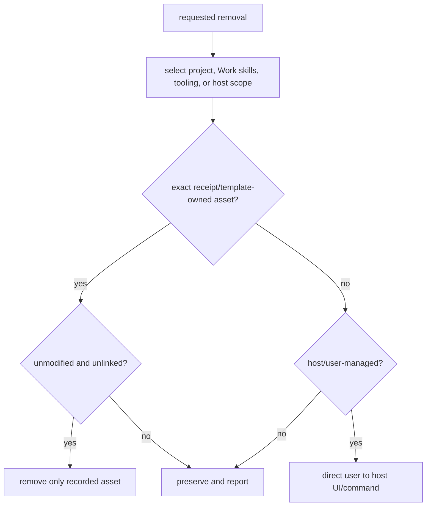

# Safe removal

Removal follows ownership, not a broad directory delete. LazyTrae removes only
assets that still match its receipts/templates and preserves modified, unknown,
foreign, linked, caller-owned, project, and host-managed paths.

## Choose the smallest removal

The project-local commands below require your explicit approval for the
selected removal scope:

```bash
lazytrae uninstall --yes
lazytrae uninstall --yes --soft
lazytrae uninstall --yes --purge-state
```

`uninstall --yes` removes only exact project files. `--soft` removes verified
`.trae/` assets only. `--purge-state` additionally removes only exact bundled
runtime template files; it never recursively deletes a runtime directory.
`--soft` and `--purge-state` cannot be combined. Normal runtime records under
`.lazytrae/state/`, `.lazytrae/evidence/`, `.lazytrae/plans/`, and
`.lazytrae/loop/` are preserved.

For Trae Work on macOS, run `lazytrae work uninstall` only after the operator
explicitly approves removing global Work skills; then run `lazytrae work status`
and observe which skills remain. It removes only manifest-listed `lazy-*`
skills whose sole `SKILL.md` exactly matches the bundled content. It refuses
symlinks and hard links and preserves edited or nonempty skill directories. On
Linux or Windows, use `--skills-dir` only after the host itself reports the
directory; those defaults are not verified.

## Remove host registrations separately

Project cleanup never changes a host-managed registration. After the package
step, remove the relevant registration only after the operator explicitly
approves that host-managed change, then observe that the registration is gone:

- **Trae IDE:** remove or disable a separately added `lazytrae` server through
  the IDE’s MCP settings.
- **Trae Work:** remove `lazytrae mcp` through **Settings → MCP**.
- **Trae CLI:** remove the registration through the selected build's
  documented/manual MCP settings flow, then start a new session and confirm
  the registration is absent. No public universal Trae CLI MCP removal command
  is assumed.

If you no longer need the companion command globally, remove it separately
with `npm uninstall -g lazytrae-ai` only after explicit operator approval; then
run `lazytrae --version` (or inspect your global package list) and observe the
result. Never guess a host-managed path. The full surface-by-surface boundary
is in [Host routes](reference/host-routes.md).

## Optional tooling has its own receipt

LSP toolpacks and CodeGraph use explicit tooling roots. Their uninstall routes
remove only an unmodified receipt-owned root. In particular, CodeGraph removal
does not remove a project `.codegraph/` directory because that index is
caller-owned. Disable optional remote MCP selections with `lazytrae tooling
disable <capability>`; this removes only the corresponding LazyTrae-managed
entry. See [Capabilities and approvals](06-capabilities-and-approvals.md).

If removal preserves something, treat that as a safety result rather than an
error to work around. Inspect ownership and decide explicitly before deleting a
modified or host-managed asset.

For the underlying rules, see [Receipts and owned tooling](06b-receipts-and-owned-tooling.md).

## Removal decision flow



The important implementation rule is that a refusal is a successful safety outcome. `uninstall.js` and tooling-root helpers validate ownership before deleting project/tooling assets; Work removal separately checks each installed skill. No command turns a directory name, host registration, or `.codegraph` index into proof of package ownership.
