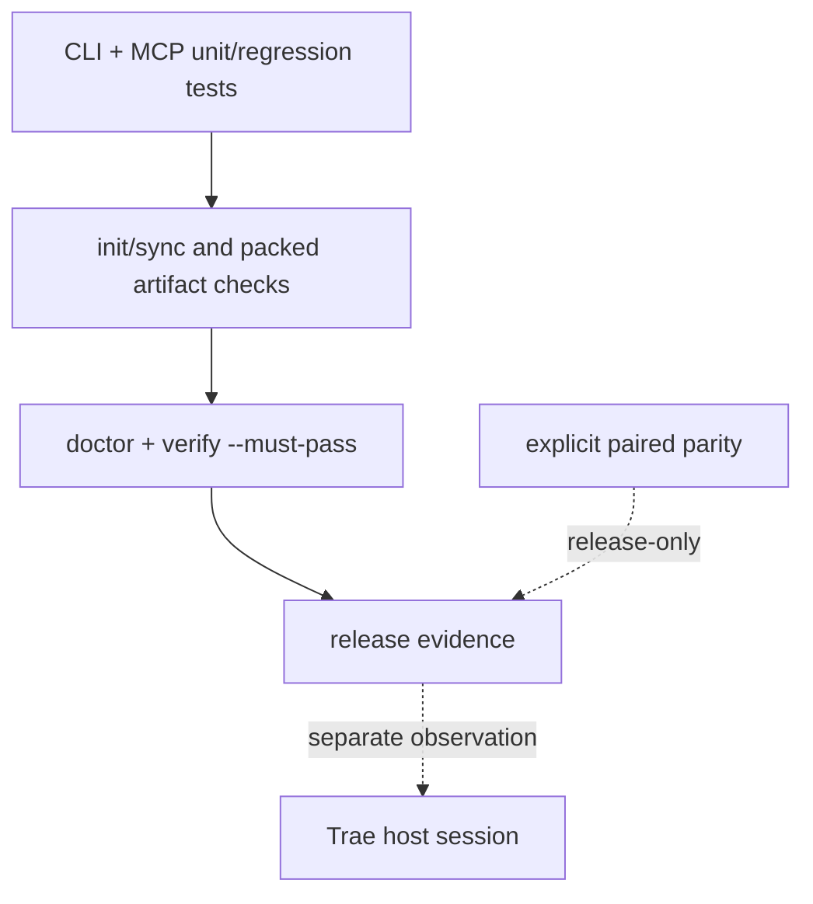

# Test and release verification

LazyTrae uses layered evidence. A release check is useful only when its scope is explicit: a unit test does not prove a packed artifact, a packed artifact does not prove a host connection, and host observation does not rewrite package ownership.

## Package checks

The CLI suite exercises templates, managed writes, fresh initialization, sync, doctor, completion gates, uninstall, tooling lifecycle, schema validation, Work skills paths, packed offline installation, and source/packaged MCP equivalence. The MCP suite drives the stdio server with valid and malformed JSON-RPC lines to ensure protocol errors do not terminate later requests.

The cold offline packed-artifact check establishes that the **self-contained CLI tarball** contains the CLI, packaged MCP runtime, templates, notices, and production dependency closure. It is stronger than a source-tree smoke test, but still package evidence rather than host proof.

## Release evidence boundary

`doctor` reports readiness and warnings. `verify --must-pass` adds completion gate status and exits unsuccessfully when either doctor or the gates are not ready. Trae hooks are advisory, so completion enforcement intentionally lives in these CLI/MCP paths rather than in host hook exit codes.

Normal CI is self-contained: it does not require a sibling repository. Documentation and contract parity with LazyBuddy are release-only paired parity checks, run only when both absolute roots are explicitly supplied. That keeps the shared safety contract auditable without creating a runtime, installer, or CI dependency between packages.

The final host layer is intentionally manual. A selected Trae host must show asset discovery, any relevant hook behavior, and MCP connection before those facts are claimed. Current package evidence is verified on macOS only.
