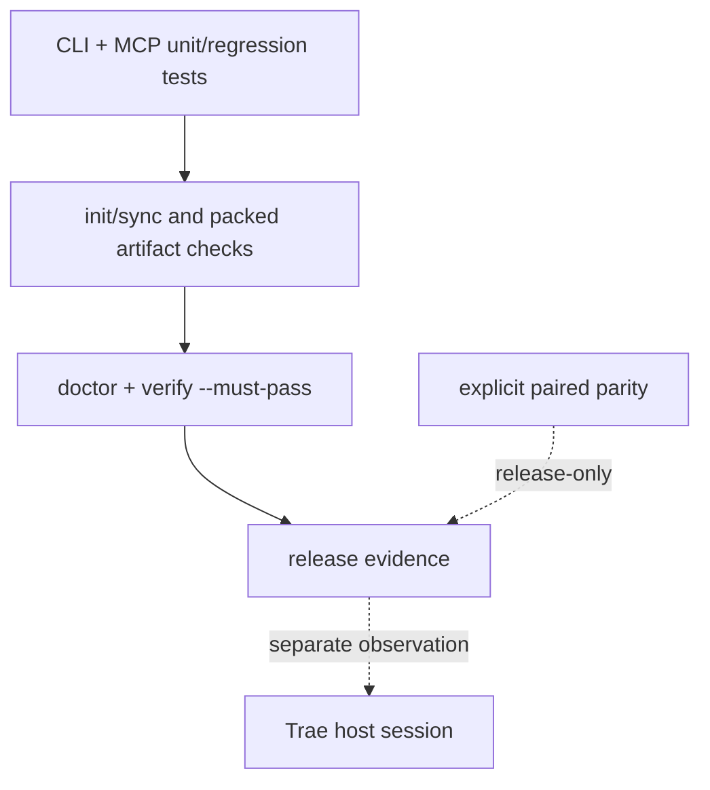

# Test and release verification

**Current documentation release: v1.2.0.** Release checks must distinguish a
local generator/profile/probe result from a native host observation.

LazyTrae uses layered evidence. A release check is useful only when its scope is explicit: a unit test does not prove a packed artifact, a packed artifact does not prove a host connection, and host observation does not rewrite package ownership.

## Package checks

The CLI suite exercises templates, managed writes, fresh initialization, sync, doctor, completion gates, uninstall, tooling lifecycle, schema validation, Work skills paths, packed offline installation, and source/packaged MCP equivalence. The MCP suite drives the stdio server with valid and malformed JSON-RPC lines to ensure protocol errors do not terminate later requests.

The cold offline packed-artifact check establishes that the **self-contained CLI tarball** contains the CLI, packaged MCP runtime, templates, notices, and production dependency closure. It is stronger than a source-tree smoke test, but still package evidence rather than host proof.

From `lazytrae-plugin/packages/cli`, `npm run test:source` discovers only
`*.test.js` files outside the explicit archive-contained package suite, while
`npm run test:package` runs that package suite. Their inventories have no
intersection, and `npm run test:all` is their complete union. Helper programs
such as the JSON-RPC caller, MCP helper, fixture-cleanup preload, and shared test
helpers are not test files and are never discovered as tests.

The fixture harness uses two workers by default. Set
`LAZYTRAE_TEST_CONCURRENCY` to an integer from `1` through `4`; malformed or
out-of-range values fail before tests start. The bounded lock/process timing
tests stay on the serial path even when the rest of the suite uses concurrency.

## Release evidence boundary

`doctor` reports readiness and warnings. `verify --must-pass` adds completion gate status and exits unsuccessfully when either doctor or the gates are not ready. Trae hooks are advisory, so completion enforcement intentionally lives in these CLI/MCP paths rather than in host hook exit codes.

The risk-based `verify --json` report includes a monotonic in-memory
`elapsed_ms` total and an `elapsed_ms` value on every gate outcome. It does not
persist those timings. Efficiency fixtures name their separate validation-time
field `validation_elapsed_ms`, including an explicit unavailable reason when no
measurement exists.

Normal CI is self-contained: it does not require a sibling repository. Documentation and contract parity with LazyBuddy are release-only paired parity checks, run only when both absolute roots are explicitly supplied. That keeps the shared safety contract auditable without creating a runtime, installer, or CI dependency between packages.

The final host layer is intentionally manual. A selected Trae host must show asset discovery, any relevant hook behavior, and MCP connection before those facts are claimed. Current package evidence is verified on macOS only.

## v1.1 host-boundary release checks

The release documentation contract checks all three independent host sections,
the explicit Work `--client`/`--execution` matrix, inert `.traecli/`
generation, bounded credential-free probes, v2 current writers, and read-only
historical v1 evidence. It rejects a malformed local link or JSON reference,
unsupported universal host command, marketplace publish/install, cloud upload,
and package-to-host readiness promotion. A passing textual status cannot
override a broken link or forbidden claim.

## How to read a regression by boundary

The Node tests are intentionally organized around a boundary rather than an
implementation detail. For example:

| Test family | Fixture/action | Failure it prevents |
| --- | --- | --- |
| init/sync/load-check | temporary initialized project | Source-tree assumptions or managed content overwriting user files. |
| state contracts | malformed JSON, versions, timestamps, evidence paths | Accepting state that cannot support a completion claim. |
| safe write/path | escape, link, and protected-destination fixtures | Writing outside a project or over protected assets. |
| tooling lifecycle | explicit roots, receipts, provider states | Implicit installs or removal of caller-owned paths. |
| packed MCP/JSON-RPC | cold package install and malformed stream | Artifact-only import bugs or a bad request killing later requests. |

When a regression fails, start from its fixture and expected assertion, then follow the smallest source function named in the failure. Do not “fix” a release check by weakening its assertion: each assertion encodes a published ownership or evidence contract.

## Adaptive harness (v1.0.3)

The v1.0.3 adaptive harness adds behavior-only tests on top of the layered
checks above. They prove the harness selects the smallest sufficient workflow
mode, composes existing Skills/agents/commands/MCPs/tools/hooks/verifiers,
persists an additive single-writer snapshot, falls back safely, escalates
within bounds, and explains material choices. They are `package evidence` —
they do not prove a live host loaded the package or connected the core MCP.

| Test family | Fixture/action | Failure it prevents |
| --- | --- | --- |
| adaptive contract + digest parity | byte-identical contract with LazyBuddy; ajv schema validation; sha256 digest | A drift in the shared behavior contract between the two repos. |
| adaptive detector | classifier returns structured decision per Section 5 schema for each fixture | Mixing classification with provider activation; missing reasons/approvalRequired. |
| adaptive mapping per mode | each of direct/assisted/planned/orchestrated/long-horizon maps to existing surfaces | A mode with no runtime mapping or duplicated orchestration logic. |
| adaptive snapshot backward-compat | v1.0.2 state without `adaptive` block continues to load; single-writer rule enforced | Breaking v1.0.2 state or allowing non-orchestrator writes. |
| adaptive explanation | `completion-status` output includes mode/stages/responsibilities/capabilities/not-selected/approval | Suppressing material choices or exposing internal routing noise. |
| adaptive W4.1 explicit override | explicit named workflow remains authoritative; classifier does not silently downgrade | Silent replacement of explicit user requests. |
| adaptive W4.2 bounded escalation | max-two-escalation bound; blocked-state record with reproduced failure and next decision | Indefinite escalation or growing repair lineage. |
| adaptive W4.3 capability fallback | preferred provider unavailable → safe fallback in same class; substitution reported; no approval-free remote activation | Hidden provider authority or false equivalent-evidence claims. |
| adaptive W4.4 responsibility ownership | one owner per stage; no duplicate work in orchestrated mode | Parallel agents duplicating investigation or edits. |
| adaptive W4.5 continuation (gap) | incompatible-revision forces fresh decision; original snapshot preserved; **compatible-resume is a known v1.0.3 `xfail`** | Accepting a stale snapshot as completion evidence; mutating old goals invisibly. |
| adaptive W4.6 evidence freshness (gap) | revisionMarker present; `validateEvidencePaths` rejects missing paths; **stale detection and re-verification signalling are known v1.0.3 `xfail` cases** | A snapshot resuming silently after implementation changes. |

### Adaptive evidence boundary

Adaptive tests are `package evidence`. They prove the contract, classifier,
mapping, snapshot, and explanation modules behave per the shared contract
against the shared fixture set. They do **not** prove that a live TraeCode,
TraeWork, or TraeCode CLI session observed adaptive selection, the explanation
surface, failure escalation, or continuation. Live-host observation for W5.3
and W5.4 is **PENDING** — see the known gaps in
[`docs/v1.0.3-adaptive-harness-contract.md`](v1.0.3-adaptive-harness-contract.md).
