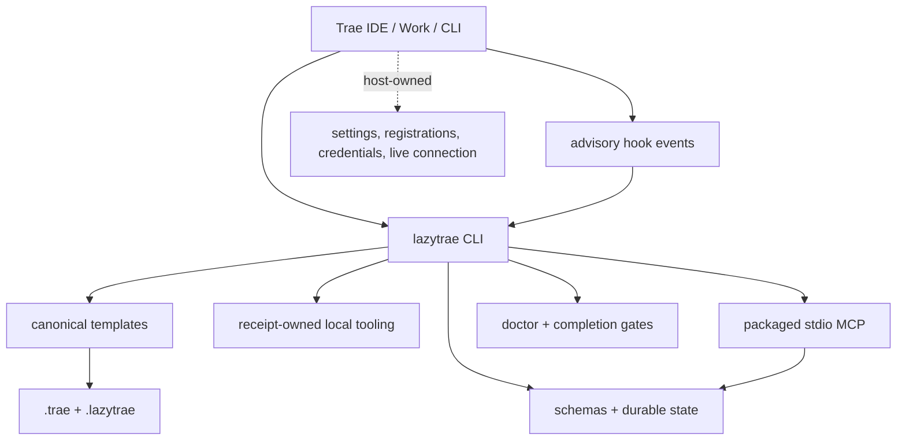

# Technical architecture guide

This tree explains how LazyTrae is built. It is a source-reading guide, not an
installation manual: each page names the executable boundary, the data it
owns, and the evidence that constrains its behavior. Use the root
[README](../README.md) for host directions.

## System at a glance

The CLI is the control plane. Templates create managed project assets, schemas
constrain state, and the MCP server offers a separate JSON-RPC surface. Host
settings and live integration remain outside package ownership.

## Read the implementation in this order

1. [00 — Architecture tour](00-learning-path.md) identifies the package
   boundary and template-to-project flow.
2. [01 — Execution model](01-mental-model.md) explains workflow text, CLI
   commands, templates, hooks, state, and proof as separate layers.
3. [07 — Package map](07-package-map.md) maps those layers to files; follow it
   with [07a — State and validation](07a-state-and-validation.md) and
   [07b — MCP lifecycle](07b-mcp-lifecycle.md).
4. [06a — Security and authority](06a-security-and-authority.md) and
   [06b — Receipts and owned tooling](06b-receipts-and-owned-tooling.md)
   explain fail-closed writes, explicit roots, and receipt-safe removal.
5. [09 — Test and release verification](09-test-and-release-verification.md)
   connects the suite, packed artifact checks, and host observation boundary.

## Technical map

| Page | Implementation question answered |
| --- | --- |
| [00 — Architecture tour](00-learning-path.md) | Which component receives a command, and where does its result go? |
| [01 — Execution model](01-mental-model.md) | Why are instructions, templates, execution, state, and proof distinct layers? |
| [02 — Request decomposition](02-first-task.md) | How does an outcome become acceptance criteria and a proof surface? |
| [03 — Package delivery](03-install-and-host-verification.md) | What does `init` copy, and what remains a host observation? |
| [04 — Workflow playbooks](04-workflow-playbooks.md) | How do skills, commands, and agent roles encode proportional workflow policy? |
| [05 — Evidence and completion](05-evidence-and-completion.md) | How are doctor, gates, statuses, and completion claims kept honest? |
| [06 — Capabilities and approvals](06-capabilities-and-approvals.md) | How does local-first capability selection avoid persistent mutation? |
| [06a — Security and authority](06a-security-and-authority.md) | Which paths, writes, credentials, and user decisions are trusted? |
| [06b — Receipts and owned tooling](06b-receipts-and-owned-tooling.md) | How does tooling record and later prove limited ownership? |
| [07 — Package map](07-package-map.md) | Which source directories implement the CLI, templates, and MCP? |
| [07a — State and validation](07a-state-and-validation.md) | Which artifacts are durable, schema-validated, and safe to mutate? |
| [07b — MCP lifecycle](07b-mcp-lifecycle.md) | How does a declaration become a JSON-RPC process without becoming host proof? |
| [08 — Safe removal](08-safe-removal.md) | Why does removal stop at package-owned paths? |
| [09 — Test and release verification](09-test-and-release-verification.md) | What does each release gate prove? |
| [10 — Host capability matrix](10-host-capability-matrix.md) | Where do Trae IDE, Work, and CLI intentionally diverge? |
| [v1.1.0 migration guide](v1.1.0-migration-guide.md) | How do native host boundaries, v2 evidence, profiles, probes, and scoped offboard work? |

The lookup tables in [reference](reference/) provide the concrete state
artifacts, MCP inventory, verification vocabulary, and host routes used by
these explanations.

For the full split between package-built functions, receipt-owned dependencies,
optional providers, and raw host capabilities, read the [dependency and host
boundary reference](reference/dependency-and-host-boundaries.md).

For a complete source-family index, including command families, templates,
hooks, helper libraries, provider lifecycle, and release checks, read the
[runtime subsystem reference](reference/runtime-subsystems.md).
