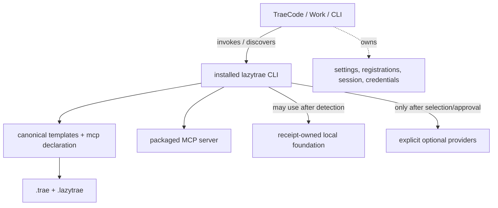

# Dependency and host boundary reference

This page answers a common source-reading question: which behavior is supplied by LazyTrae itself, which behavior is borrowed from an installed dependency, and which behavior belongs entirely to TraeCode, Work, or CLI?

## Four dependency classes

| Class | Examples | Who supplies it | When it runs | What LazyTrae can claim |
| --- | --- | --- | --- | --- |
| Package implementation | CLI commands, templates, schemas, safe-write helpers, MCP handlers | LazyTrae package | `lazytrae` invocation or host core-server launch | The CLI/MCP artifact and local behavior are tested. |
| Host runtime | Project discovery, Work skill loading, CLI MCP registration, hook delivery | TraeCode, Work, or CLI | Only inside the selected host/session | Nothing until the user observes it. |
| Local foundation | `rg`, `sg`, JS/TS or Python LSP fallback | Existing machine tool or receipt-owned toolpack | Task-scoped local work | A provider is available within its defined root. |
| Optional/remote provider | CodeGraph, Context7, `grep_app`, filesystem, Playwright | Explicit provider lifecycle and host | Only after selection/approval | Selected configuration or receipt state, never connection. |

## What LazyTrae implements directly

The package implements the command router, template installer/sync, managed blocks, path-safe atomic writes, schemas, doctor/completion gates, receipt verification, and self-contained local MCP process. `init` copies or merges canonical assets into `.trae/` and `.lazytrae/`; `verify --must-pass` combines health output with completion-gate state; the MCP server maps 15 namespaced tools to local state/evidence/context handlers.

The CLI carries its production dependency closure for the installed artifact. Its tooling lifecycle pins fallback packages for ripgrep, ast-grep, and CodeGraph; it detects existing providers first and installs only into a caller-selected receipt-owned root. LSP fallbacks are selected by supported workspace language. None of these paths modifies target dependency manifests, lockfiles, or host settings.

## What remains a raw host capability

TraeCode owns project discovery and host MCP connection. TraeWork owns global skill discovery and requires its own manual MCP setting. TraeCode CLI owns MCP registration and the new session that consumes it. All selected hosts own settings, marketplace behavior, credential storage, session lifetime, and hook event delivery. LazyTrae supplies project files and a command/stdio endpoint; it does not reimplement those services or inspect private host state to guess success.

Trae hooks are deliberately advisory: they can surface policy or evidence status, but exit successfully. Hard completion enforcement is therefore a LazyTrae CLI/MCP capability, not a raw hook capability.

## Dependency decision sequence

1. The capability broker classifies a task and checks an existing local tool.
2. If compatible, it is used without a project mutation.
3. If the local foundation is missing and policy allows it, a pinned fallback is installed in an explicit empty receipt-owned root.
4. Architecture, remote, browser, filesystem, credential, cost, egress, and host-registration decisions remain explicit.
5. A host may start `lazytrae mcp` only after its registration/discovery route selects it; connection is host evidence, not package evidence.

For endpoint details, see [MCP inventory](mcp-inventory.md). For the policy, see [Capabilities and approvals](../06-capabilities-and-approvals.md).
