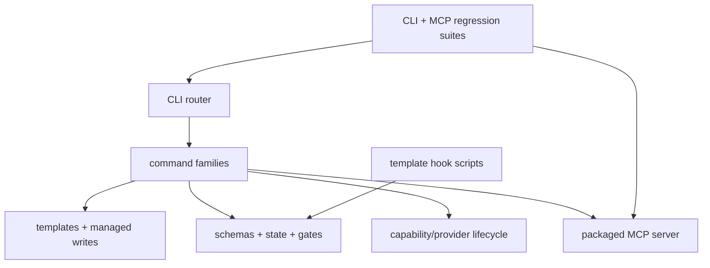

# Runtime subsystem reference

This source-index groups every LazyTrae runtime family by responsibility, including smaller command and library modules that are easy to miss when reading only install, doctor, and MCP paths.

## Command families

`src/index.js` is the router. `init.js`/`sync.js` install and update templates; `doctor.js`, `verify.js`, and `completion-status.js` report health/completion; `uninstall.js` removes owned assets; `mcp.js` launches the server; `hook.js` dispatches hook payloads. `run.js`/`handoff.js` manage run output, `loop.js` durable iteration, `team.js` structured team state, and `work.js` the bounded Trae Work skill route.

`setup.js` and `providers.js` expose configuration/provider lifecycle without raw credentials in project state. `tooling.js`, `lsp.js`, and `codegraph.js` expose local tooling. Each command performs narrow argument handling and delegates durable behavior to `src/lib/`.

## Shared library subsystems

`templates.js`, `managed-blocks.js`, `managed-gitignore.js`, `owned-assets.js`, `path-boundary.js`, and `safe-write.js` form installation/write behavior. `validator.js`, `active-plan.js`, `completion-gates.js`, `loop-store.js`, `loop-runtime.js`, `loop-quality.js`, and `loop-steering.js` form the state/completion layer. `context-recovery.js` and `model-routing-check.js` supply advisory context/model checks rather than host authority.

`automatic-tooling-*`, `tooling-*`, `lsp-*`, `codegraph-lifecycle.js`, `provider-lifecycle.js`, and `task-codegraph.js` divide policy, detection, receipts, provider lifecycle, LSP, CodeGraph, and native verification. `owned-process-runner.js` applies best-effort owned-process-group cleanup to trusted package commands.

## Templates, hooks, and project state

`packages/cli/templates/` is the installation source of truth: skills, commands, agents, rules, schemas, initial state, evidence templates, MCP content, and hook scripts. The hook family covers session start, user prompt, pre/post tool, stop, dynamic rules, and context recovery. Hooks surface guidance/state but remain advisory; completion enforcement is kept in CLI/MCP gates.

Schemas cover active-loop, Boulder, evidence, sessions, and team records. The validator directly validates active-loop, Boulder, and sessions; the others define the same package state vocabulary for their owning subsystems. Project mutations remain below `.trae` or `.lazytrae` under the safe-write boundary.

## Packaged MCP and parity layer

`packages/mcp/` is the standalone stdio artifact. Split handler modules cover reads, evidence, review, handoff, and local context; runtime modules cover active plan, completion gates, path boundaries, and safe writes. `parity.js` and the CLI MCP mirror keep the installed CLI surface aligned with the standalone package. Tests exercise both packed and CLI-launched server paths.

## Verification layer

The CLI suite uses temporary initialized projects, malformed state, protected destinations, explicit tooling roots, packed installs, and JSON-RPC streams to test boundaries. Documentation parity is release-only with explicit sibling roots; normal CI and installed-package behavior have no sibling repository dependency.

Use [Package map](../07-package-map.md), [MCP inventory](mcp-inventory.md), and [Dependency and host boundary reference](dependency-and-host-boundaries.md) to continue the trace.
