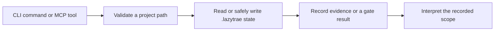

# State artifact reference

LazyTrae state is stored under `.lazytrae/` in an initialized project. It is
durable workflow evidence, not a replacement for user-surface verification.

| Path | Purpose |
| --- | --- |
| `.lazytrae/state/boulder.json` | Active work, tasks, blockers, and evidence paths. |
| `.lazytrae/state/active-loop.json` | Long-running loop lifecycle. |
| `.lazytrae/state/sessions.json` | Session records. |
| `.lazytrae/schemas/` | JSON Schema definitions for supported state. |
| `.lazytrae/plans/` | Plan artifacts referenced by work state. |
| `.lazytrae/evidence/` | Evidence and handoff records. |
| `.lazytrae/loop/` | Per-run loop artifacts. |

## Validation contract

`doctor` validates `boulder.json`, `active-loop.json`, and `sessions.json`
against their bundled schemas and version contracts. The validator includes
`ajv-formats`, enforcing RFC3339 `date-time` fields. It reports invalid JSON,
schema, version, or date-time values rather than treating them as valid.

Completed tasks require existing non-empty evidence paths. Paths are resolved
inside the project boundary. See [State and validation](../07a-state-and-validation.md).

## State transition ownership

`state-access.js` confines MCP paths to the initialized project. CLI
safe-write helpers atomically replace approved targets. Completion reads
evidence before changing status, but state never proves a host connection.
